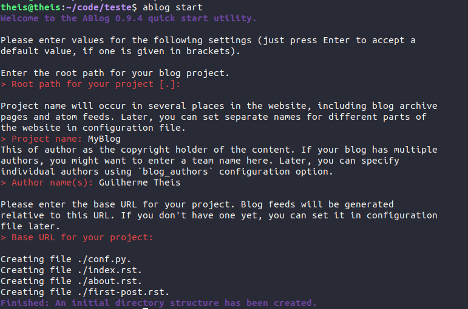

.. _Anaconda: https://www.anaconda.com/
.. _Ubuntu: https://www.ubuntu.com/
.. _Ablog: https://ablog.readthedocs.io/
.. _Github: https://github.com/
.. _Pages: https://pages.github.com/
.. _Sphinx: https://www.sphinx-doc.org/en/master/index.html
.. _reStructuredText: http://docutils.sourceforge.net/rst.html
.. _Disqus: https://disqus.com/
.. _this: https://support.google.com/analytics/answer/1008015?hl=en

Using ABlog's and Github Pages
===============================

.. post:: Mar 02, 2019
   :tags: ABlog, Github Pages,
   :author: Guilherme Theis
   :category:

This is a step-by-step to create an ABlog's based blog using Github Pages as host site. I want to write this because this was not clear for me that have somewhat of a base in programming and RST. I hope this can help others and also remind me how to set up blogs if I need one day. The setup used here is an Ubuntu 18.04 LTS with python 3.7 (installed by using Anaconda -- which is great for anyone who is working with data and data analysis as I am working right now). I will explain every installation to obtain the setup I am using. 

The whole propose of this is to be a "dumb proof" material. I've been doing this since I've entered the university with my study notes because I found out that what can sound easy to me sometimes is hard to someone else and vice-versa while this is also true for the present me, which means I am dumber depending on the moment of my life. That's why I try to force myself to write and explain everything in the easiest way possible with maximum of detail possible, which can be boring sometimes.

What is Ablog?
--------------

Ablog_ is an Sphinx_ extension that allows to easily set up a Sphinx based blog. Sphinx is a tool that makes easy to create documentation using reStructuredText_, it was written by Georg Brandl.

Python install
--------------

Firstly, I've installed my ``python3`` using Anaconda, doing this using ``python2.7`` doesn't work. I am currently working with some data analysis and I find the Spyder3 environement perfect to do it, plus the Anaconda_ install automates the installation of the different packages I may need. I am also using Ubuntu_ 18.04 LTS. Anaconda should also allow you to install different Python libraries using a GUI, which can be easier than using the terminal for beginners.

ABlog installation
------------------

To install Ablog using linux you need simply to use pip for the installation (this will required aditionnaly to install pip because this is not done by Anaconda) to do so you'll need to run:

.. code-block:: bash

    sudo apt install python3-pip
    pip install -U ablog

Setting up the blog
-------------------

To set up the blog two Github_ repositories are required, the first repository for the generated files for the blog and a second one to host the site using Github Pages_. The first one you can call whatever you want, while the second respository needs to have exactly this format: ``GithubUserName.github.io``. The domain of your blog is going to be then the same as the second respository name.

Once you've created both of the repositories, you should clone the first one and run a ``Ablog start``, the picture shows how to set it up. Once you've set your blog initially you can change your ``conf.py`` file and customize a little bit the blog.

Once this is set, we can customize the blog, but first lets talk about the structure created, your repository should be like this:

.. code-block:: bash

    .
    ├── about.rst
    ├── conf.py
    ├── first-post.rst
    ├── index.rst
    ├── _static
    └── _templates

The two folders are used for static documents such as images and for different themes, respectively -- I don't mess much with the theme here, I like the Alabaster theme. The ``about.rst`` and the ``first-post.rst`` are two RST files created automatically, the first one to create some information about the site and the second one is your first blog post basically. The ``index.rst`` created the index of your site. The ``conf.py`` is the configuration of your website, that is going to translate the RST into HTML and so on.

Customization
-------------

To customize the website, we'll modify the ``conf.py`` file to customize the site. The first step is to add Disqus_ to enable comments to your posts. You'll need to create an account and then add a site, once you've created your site you can see the ``short-name`` in the settings of the site and an URL is going to be generated, you need to add this into the ``blog_baseurl`` field and also add a new line called ``disqus_shortname`` (this should be located at the line 26 of your ``conf.py``). You can see my configuration here:

.. code-block:: python

    # Base URL for the website, required for generating feeds.
    # e.g. blog_baseurl = "http://example.com/"
    blog_baseurl = u'https://guilherme-theis.disqus.com''True'
    #discus_shortname
    disqus_shortname = 'guilherme-theis'

Then we can customize the HTML_theme, in the line 250 of the ``conf.py``. This allow to add the logo of the site, the github repository, to use google analytics, etc. Here you can see my current settings:

.. code-block:: python

    html_theme_options = {
        'github_button': True,
        'logo': 'gTheisBlogLogo.png',
        'github_user': 'guilhermetheis',
        'github_repo': 'gtheisBlog',
        'body_text_align': 'justify',
        'show_powered_by': True,
        'analytics_id' : 'UA-135113128-1',
        'font_family' : "Times New Roman",
        #'font_size': 'large',
        #'rightsidebar': True,
    }

The analytics_id allows to set up a google analytics tracking of your site, you can start using google analytics following this_.

Site deploy
-----------

Firstly is recommended to deploy your site locally to verify any bug you may have, so you need to first build it and then say that you want to deploy it locally by doing:

.. code-block:: bash

    ablog build
    ablog serve

The second command is going to open your website under the 127.0.0.1:8080. Then you can deploy your site using Github Pages by doing:

.. code-block:: bash

    ablog build
    ablog deploy -p "../githubUserName.github.io/" -g "githubUserName" -m "commit message"

This assuming that the path of your ``githubUserName.github.io`` is one folder up to the folders hierarchy, the path can be different. This will firstly pull your ``githubUserName.github.io``, then add the files and then commit and push your website. Within 5 minutes your blog is going to online and updated.
